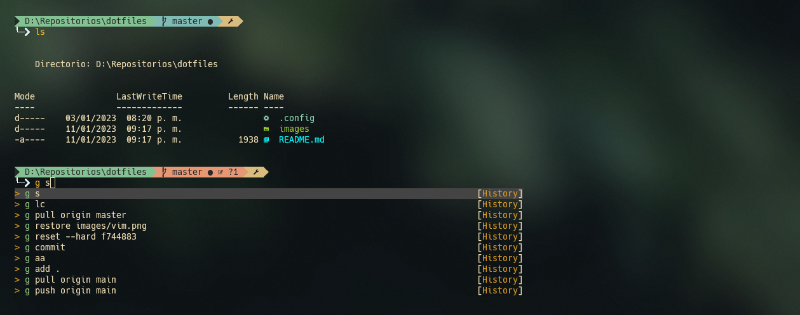
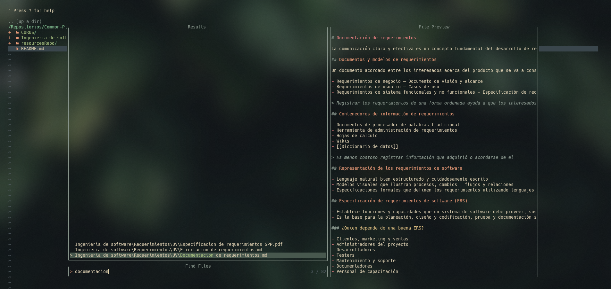

# My  dotfiles
Enviroment configurations for development

## Contents
- PowerShell 
- NeoVim 
- git 

## PowerShell setup

- [Oh My Posh](https://ohmyposh.dev/) - Prompt theme engine
	> I use a modification of [gruvbox theme](https://ohmyposh.dev/docs/themes#gruvbox).
- [Terminal Icons](https://github.com/devblackops/Terminal-Icons) - Folder and file icons
- [PSReadLine](https://docs.microsoft.com/en-us/powershell/module/psreadline/) - Cmdlets for customizing the editing environment, used for autocompletion

## Neovim setup

### Theme
- [Everforest](https://github.com/sainnhe/everforest)
### Syntax
- [coc.nvim](https://github.com/neoclide/coc.nvim) - Nodejs extension host for vim & neovim
- [vim-polyglot](https://github.com/sheerun/vim-polyglot) - A collection of language packs for Vim.
- [nvim-autopairs](https://github.com/windwp/nvim-autopairs) - Plugin for Neovim that supports multiple characters.
- [emmet-vim](https://github.com/mattn/emmet-vim) - Vim plug-in which provides support for expanding abbreviations.
### GUI
- [nerdtree](https://github.com/preservim/nerdtree) - File system explorer for the Vim editor.
- [vim-devicons](https://github.com/ryanoasis/vim-devicons) - Icons for vim.
- [stat.nvim](https://github.com/leath-dub/stat.nvim) - Less bloated statusline.
- [dashboard-nvim](https://github.com/glepnir/dashboard-nvim) - Fancy Fastest Async Start Screen Plugin of Neovim.
### Utilities
- [goyo.vim](https://github.com/junegunn/goyo.vim) - Distraction-free writing in Vim.
- [markdown-preview.nvim](https://github.com/iamcco/markdown-preview.nvim) - Preview markdown on your modern browser.
- [vim-commentary](https://github.com/tpope/vim-commentary) - Comments for nvim.
- 
### Finder
- [telescope.nvim](https://github.com/nvim-telescope/telescope.nvim) - Gaze deeply into unknown regions using the power of the moon.
- [plenary.nvim](https://github.com/nvim-lua/plenary.nvim) - All the lua functions I don't want to write twice.
